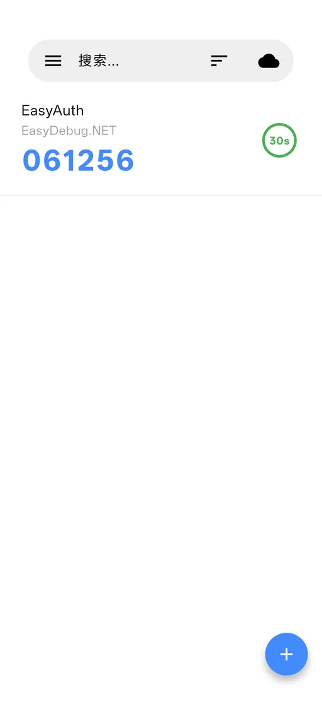
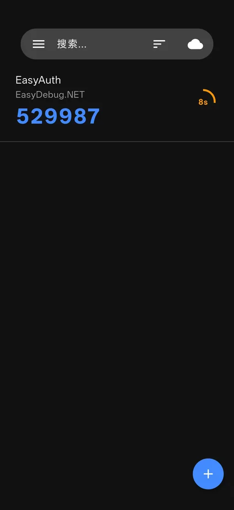

<div align="center">


# EasyAuth

**開源、離線可用、資料自主的 2FA 身份驗證器**

[官網](https://easyauth.easydebug.net/) · [GitHub](https://github.com/EasyDebug-NET/EasyAuth) · [Gitee](https://gitee.com/EasyDebug-NET/EasyAuth)

[简体中文](README.md) · [English](README.en.md) · [한국어](README.ko.md)


[](https://github.com/EasyDebug-NET/EasyAuth/releases/latest)
[](https://gitee.com/EasyDebug-NET/EasyAuth/releases/latest)

</div>

## 簡介

EasyAuth 是一款開源的本機雙因素認證（2FA）應用，支援 WebDAV 與 S3 雲端備份（堅果雲、七牛雲、AWS S3 等），兼顧資料可控與多端同步。

## 截圖

<p align="center">
   
</p>

## 功能特性

- **資料本機儲存**：2FA 金鑰保存在裝置加密區域（Android Keystore / iOS Keychain）
- **加密雲端備份**：支援 WebDAV 與 S3 相容儲存，AES-256-GCM 端到端加密
- **相容 Google Authenticator**：支援 otpauth:// 協定與遷移二維碼匯入/匯出
- **生物識別保護**：指紋 / 面容解鎖，切換背景自動鎖定
- **防截圖**：可開啟安全視窗，阻止截圖與錄影
- **多語言**：支援简体中文 / 繁體中文 / English / 한국어 / 日本語

## 技術棧

- **框架**：Flutter / Dart 3
- **狀態管理**：Provider
- **本機儲存**：flutter_secure_storage
- **加密**：encrypt（AES-256-GCM）、PBKDF2 金鑰派生
- **生物識別**：local_auth
- **二維碼**：mobile_scanner（掃描）、qr（生成）、otpauth-migration protobuf
- **雲端備份**：http、xml（WebDAV）、aws_signature_v4（S3）

> 第三方依賴詳見：https://easyauth.easydebug.net/third-party

## 構建運行

### 環境要求

- Flutter 3.x（Dart 3.12+）

### 運行

```bash
flutter pub get
flutter run
```

### 打包

```bash
flutter build apk      # Android
flutter build ios      # iOS
flutter build windows  # Windows
```

## 許可證

本專案採用 [Apache License 2.0](LICENSE) 開源協議。

## 相關連結

- 官網：https://easyauth.easydebug.net/
- GitHub：https://github.com/EasyDebug-NET/EasyAuth
- Gitee：https://gitee.com/EasyDebug-NET/EasyAuth
